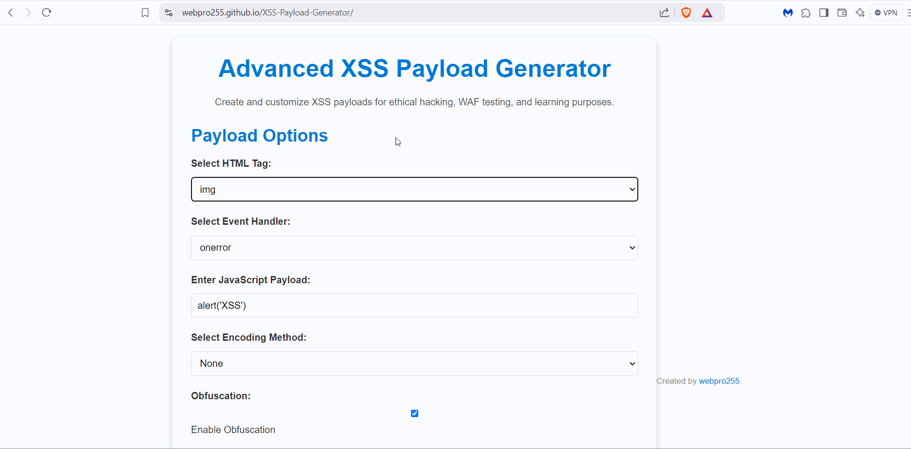

# XSS Payload Generator

A powerful, customizable XSS Payload Generator designed to help ethical hackers, penetration testers, and cybersecurity enthusiasts understand Cross-Site Scripting (XSS) vulnerabilities and test Web Application Firewalls (WAFs). This tool is ideal for learning, demonstrating attack scenarios, and creating advanced XSS payloads for testing in secure environments.

## Features
Dynamic Payload Generation
 - Choose from a variety of HTML tags, including:
   - ``
   - `<svg>`
   - `<script>`
   - `<iframe>`
   - `<a>`
   - `<div>`

 - Select common event handlers, such as:
   - `onerror`
   - `onload`
   - `onclick`
   - `onmouseover`
   - `onfocus`

## Advanced Encoding and Obfuscation
**Encode payloads to evade detection**:
 - URL Encoding
 - Base64 Encoding
 - Hexadecimal Encoding
Enable obfuscation to bypass basic security filters by injecting comments and breaking up code.

## User-Friendly Interface
 - Clean, responsive design for easy use on any device.
 - Real-time payload generation with a preview feature.

---

## How It Works

1. **Select a Tag**:
 - Choose an HTML tag (e.g.,  or <svg>) that supports JavaScript event handlers.

2. **Choose an Event Handler**:
 - Select an event that triggers JavaScript (e.g., onerror, onload).

3. **Enter a JavaScript Payload**:
 - Input the JavaScript code you want to execute (e.g., alert('XSS')).

4. **Select Encoding**:
- Choose an encoding method to obfuscate your payload.

5. **Enable Obfuscation (Optional)**:
 - Add random comments or spaces to further evade detection.

6. **Generate Payload**:
 - Click the button to generate the payload, which will be displayed in the output box.

---

## Example Payloads

**Basic Payload**
``

**Obfuscated Payload**
`<svg/onload=prompt`1`>`

**Encoded Payload (Base64)**
`PHN2ZyBvbmxvYWQ9YWxlcnQoJ1hTUycpPg==`

## Use Cases
**Education**
 - Understand how XSS vulnerabilities work.
 - Learn how attackers bypass basic security filters.

**Penetration Testing**
 - Test web applications for XSS vulnerabilities.
 - Evaluate the effectiveness of WAF configurations.

**Demonstrations**
 - Use in presentations to highlight XSS attack scenarios and mitigation strategies.

**Live Demo**
Try Live Demo of the XSS Payload Generator here: https://webpro255.github.io/XSS-Payload-Generator/

## Installation
**Clone this repository**:
   ```bash
   git clone https://github.com/webpro255/XSS-Payload-Generator.git
   ```
## Instructions for Ethical Use
 - This tool is intended for educational purposes and ethical hacking only.
 - Do not use it for illegal activities or without proper authorization.
 - Always follow your organization’s security policies and ethical guidelines.

---

## Frequently Asked Questions (FAQ)

1. **What is XSS?**
 - **Cross-Site Scripting (XSS)** is a vulnerability that allows attackers to inject malicious scripts into trusted websites, affecting users who interact with those sites.

2. **How can I practice safely?**
 - Use this tool in isolated environments, such as:
    - Virtual Machines
    - Local Test Servers
    - Penetration Testing Labs like Hack The Box or TryHackMe.

3. **How do I protect against XSS?**
 - Sanitize and validate user inputs.
 - Use **Content Security Policy (CSP)** headers.
 - Encode outputs properly.

--- 

## Roadmap
 - Future enhancements for this project include:
 - Adding predefined XSS payload templates.
 - Supporting multi-step obfuscation techniques.
 - Allowing users to save and export payloads.
 - Expanding to other vulnerability types (e.g., SQL Injection, LFI).


## Contributing
**Contributions are welcome! To contribute**:
1. Fork the repository.
2. Create a feature branch.
3. Submit a pull request with detailed descriptions of your changes.

## License
This project is licensed under the MIT License - see the LICENSE file for details.
